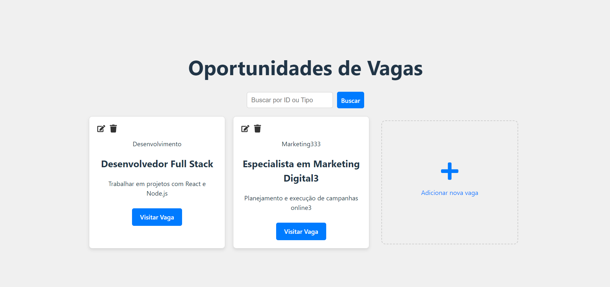
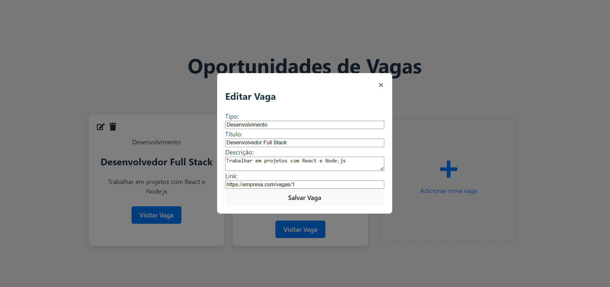
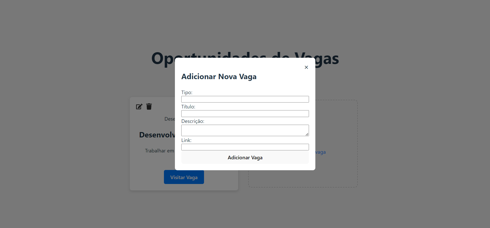

# Sistema de Oportunidades part.2 👩🏾‍💻💼
O Sistema de Oportunidades é uma API e uma interface front-end desenvolvidas para conectar pessoas de baixa renda com oportunidades de emprego, estágio, cursos gratuitos e apoio do governo, como bolsas de estudo. O principal objetivo do projeto é centralizar diversas oportunidades em um único local, tornando mais fácil e acessível o acesso a essas informações cruciais.

A aplicação foi projetada para que os usuários possam adicionar, editar, excluir e buscar vagas por título ou tipo de vaga, garantindo uma maneira prática e rápida de encontrar oportunidades relevantes.

## Funcionalidades Principais

- **Adicionar Vaga:** Permite adicionar novas vagas através de um modal.
- **Editar Vaga:** Permite editar as informações de uma vaga existente.
- **Excluir Vaga:** Permite excluir uma vaga.
- **Buscar Vagas:** Permite buscar vagas por ID ou tipo.
- **Persistência:** As vagas são armazenadas na memória durante o uso da aplicação.

## Tecnologias Utilizadas

***Back-end***
- **Node.js:** Servidor back-end com JavaScript.
- **Express.js:** Framework minimalista para APIs.
- **Axios:** Cliente HTTP para fazer as requisições entre o front e o back.

***Front-end***
- **React:** Biblioteca JavaScript para construção de interfaces de usuário baseadas em componentes.
- **Axios:** Utilizado também no front-end para consumir a API.
- **React Icons:** Para ícones de edição e exclusão

## Como Rodar o Projeto
### Pré-requisitos

   - Node.js instalado na máquina
### Passo a Passo

1. **Clone o repositório**

  ```bash
   git clone https://github.com/seu-usuario/oportunidades.git
````
2. **Instale as dependências do Back-end:** Navegue até a pasta do back-end e execute o comando:

Navegue até a pasta do projeto e execute o comando:
  ```bash
  cd backend
```
 ```bash
 npm install
```
3. **Inicie o servidor**

   Execute o comando abaixo para iniciar o servidor:

 ```bash
npm start
```
   - O servidor estará rodando na porta 4000.

4. **Instale as dependências do FrontEnd:** Navegue até a pasta do front-end e execute o comando

Navegue até a pasta do projeto e execute o comando:
  ```bash
  cd oportunidades
```
 ```bash
 npm install
```
3. **Inicie o servidor**

   Execute o comando abaixo para iniciar o servidor:

 ```bash
npm run dev
```
**Nota: Você precisará rodar dois terminais, um para o back-end e outro para o front-end.**

## Link do repositório com react e só com api
**Part 1** https://github.com/brenddamachado/Oportunidades

**Part 2** https://github.com/brenddamachado/Oportunidades_front

## Imagens do projeto

<p align="center">
  
  
  
</p>

## About
- Apresentação no LinkedIn: https://www.linkedin.com/feed/update/urn:li:activity:7244062536612859904/

## Melhorias Futuras
° Persistência em Banco de Dados: Substituir o armazenamento em memória por um banco de dados relacional (MySQL, PostgreSQL) ou não-relacional (MongoDB).

° Autenticação de Usuários: Adicionar sistema de login para que somente usuários autenticados possam editar e excluir vagas.

° Deploy: Implementar deploy no Heroku, Netlify, ou outra plataforma de cloud.

## Contribuição

Sinta-se à vontade para contribuir com este projeto. Envie um Pull Request ou abra uma Issue no repositório. Todas as sugestões são bem-vindas!

